1. Вся консоль в ошибках 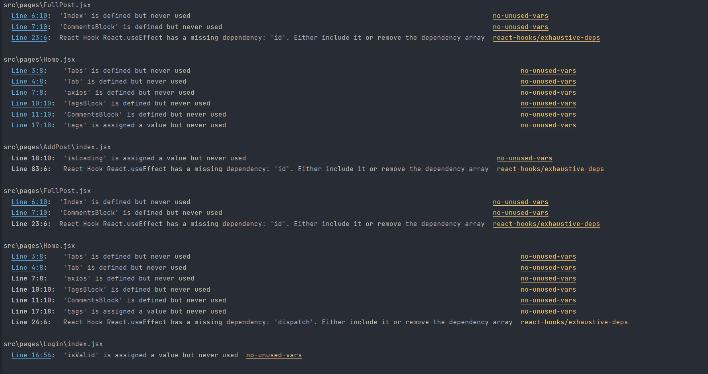
2. В readme файл стоит добавить инструкцию для запуска всего проекта, включая бек
3. /auth/me вызывается даже для юзера который незалогинен, и поэтому падает с 403 ошибкой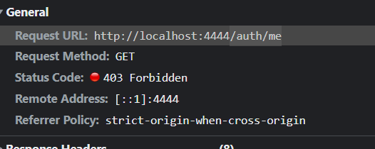
4. Не нашел картинку
5. Если юзер переходит на некорректный урл, нужно перенаправлять его на какую-нибудь страницу (например на
   главную) 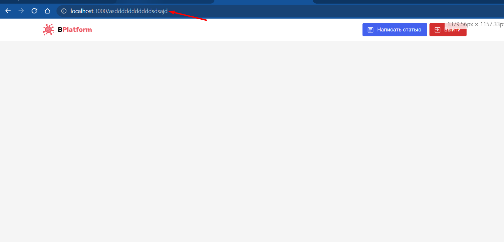
6. Нету вывода ошибок формы. Обычному юзеру придется гадать, что у него не так в форме. Причем я ввел данные корректно а
   в респонсе только сообщение "Не удалось зарегистрироваться"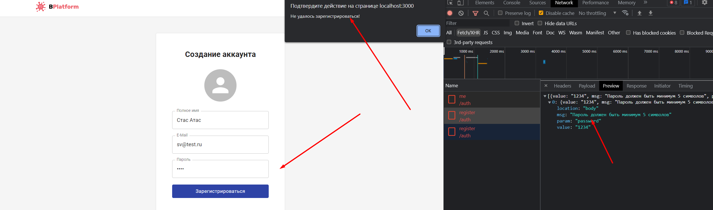
7. Вот так вот оставлять пароль не стоит ни в коем случае. Надо
   зашифровывать   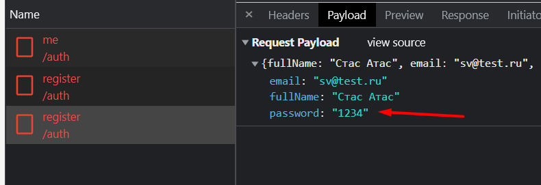 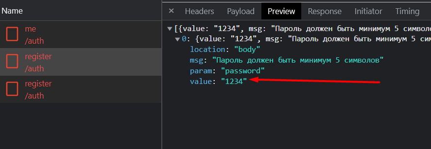
8. Нет расстояния между картинками, не прогрузилась картинка последняя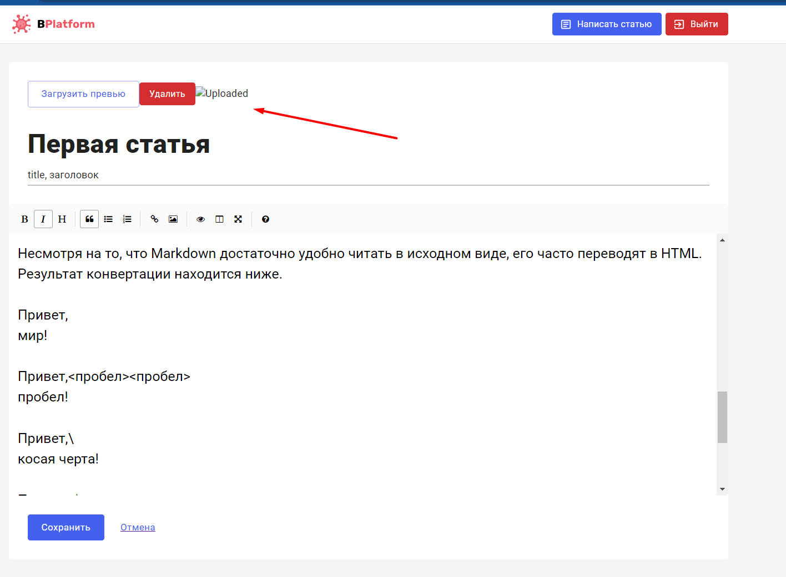
9. Не могу отредактировать статью когда нахожусь на странице этой статьи
10. Картинка не прогрузилась и место пустое, используй mah-height 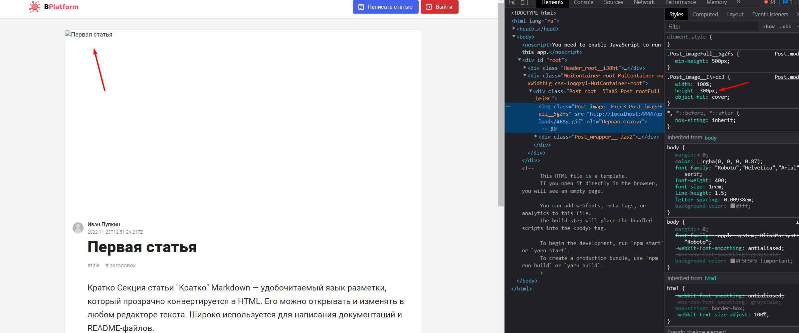
11. При создании поста нет сообщения об ошибке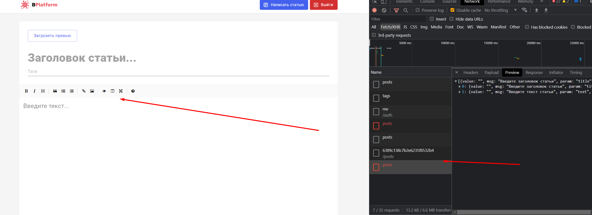
12. Нет валидации на клиенте. К примеру если юзер не заполнил необходимые данные, кнопка создания задезейблена
13. Было бы лучше если перекидывало на страницу конкретной статьи при клике на неё, а не только на заголовок. UX Был бы лучше
14. Дату стоит в выводить в более удобочитаемом виде. Например "30 Nov at 1:17 pm", полно либ для этого  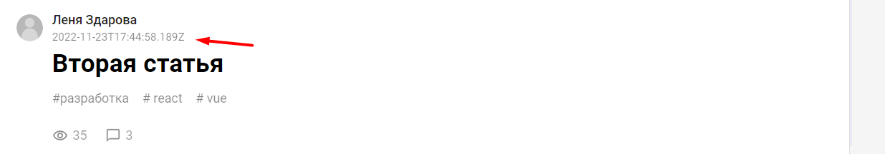
15. Есть функционал который не реализован но всё равно показан. Либо реализовывай его полностью, либо не показывай
    К примеру:
    * комменты - есть количество но нельзя никак добавить его
    * теги - при клике на тег открывается пустая страница
16. В консоли ошибки, надо разобраться в чем дело и уничтожить 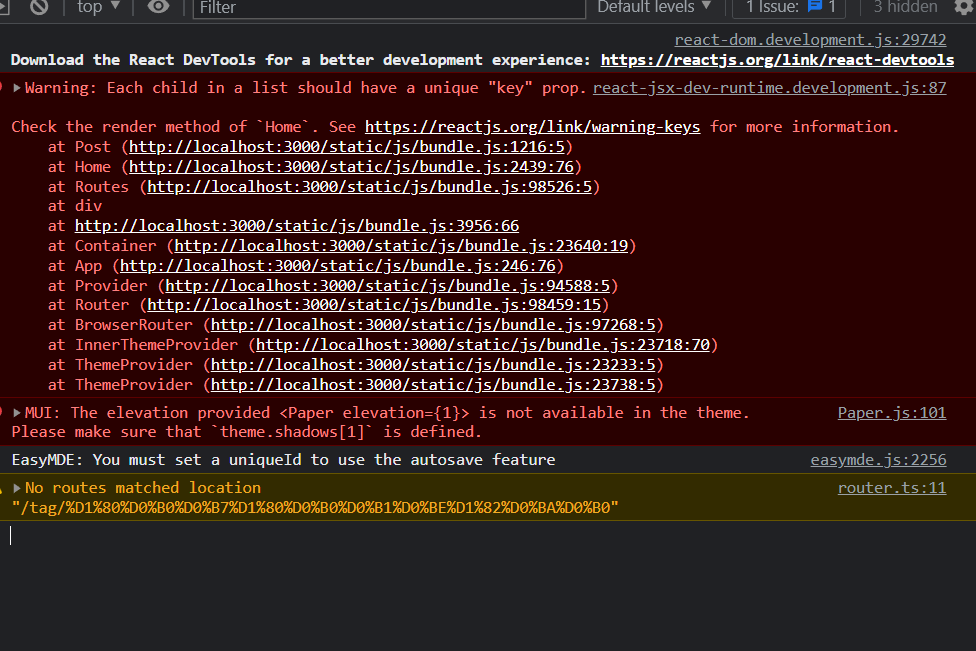
